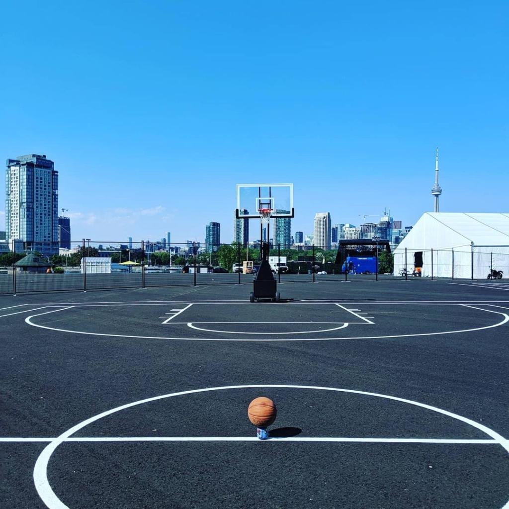

Computer Science 4WW3_Projects

- Part_1 

a. link to your live server 

https://moila.app/Project_Part_1/

b. your group partner, if applicable.

Team:
1. Quazi Rafid Ibrahim - 400158749 - ibrahimq@mcmaster.ca
2. Frank Su - 001411435 - suh6@mcmaster.ca 


c. any additional notes to the marker.

**Note**
- The pages are .php instead of .html. Hope that is fine. 
- Additional task 1 and 2 was also completed. 
- Above and beyond attempts: We made use of css animations for the search page. We also used a card style instead of html table for results page. 
We maintained all design consistant and responsive. We also worked on getting the pages perform good, accessable, followed best practices and SEO friendly by checking
against the "Lighthouse" browser extension from chrome as profressor suggested. 


**Additional Task 2 Answers**

i. Describe briefly the different versions of graphics provided in step 2(a);
include a sample of HTML code and explain how the different selectors work
together.

**Answer:**
We used a 1x for standard resolution and 2x for high-DPI retina display as asked in the assignment. 

**Pictures used:**
ballcourt1.jpg
ballcourt1-2x.jpg
ballcourt1-512.jpg
ballcourt1-512-2x.jpg
basketball-ball.png
ballcourt1-2x.png
basketball-ball-256.png
basketball-ball-256-2x.png


```
<picture>
	<source media="(min-width: 800px)" srcset="assets/img/ballcourt1.jpg, assets/img/ballcourt1-2x.jpg 2x">
	<source media="(min-width: 450px)" srcset="assets/img/ballcourt1-512.jpg, assets/img/ballcourt1-512-2x.jpg 2x">
	
</picture>

```
The <picture> with the <source> tags works by checking the min-width of the viewport. If it is atleast 800px it uses ballcourt1.jpg ballcourt1-2x.jpg depending
on the device resolution. If it's between 450-800px then it uses ballcourt1-512.jpg or ballcourt1-512-2x.jpg depending on the device resolution. For anything less than 450px, the picture element isn't supported to it uses the default  element. 

**Note: We didn't actually use retina display pictures, we just used the resized version of images to display how this functionality works**

ii. List three positive goals that can be achieved using HTML5 <picture> and
<source> attributes.

**Answer:**
1. The resolution of pictures can be defined based on screens. This gives us the option to use better resoution pictures for bigger screens.
2. Browser is determining best image based on device compatibility which is a great feature.
3. Mobile devices can use less data to load our page since we can serve lower resolution images to them. 

iii. List one negative about using HTML5 <picture> and <source> attributes. How
can this negative be mitigated?

**Answer:**
It can be tedious to use static image measurements for images. Use the source tag, we would have to adjust the picture sizes individually for these to adjust prefectly. 
This can be overcome by dynamicially sizing the images instead either individually with inline css or assigning id/class etc. 


**Extral resources credit for images/logos**
- Icons made by https://www.flaticon.com/authors/prettycons from https://www.flaticon.com/ (the basketball icon)
- Video by Pavel Danilyuk from Pexels (Background video)
- ballcourt1.jpg taken from https://www.courtsoftheworld.com/blog/top-5-basketball-courts-in-toronto/

Any opensource frameworks used? Yes. Bootstrap. https://getbootstrap.com/
